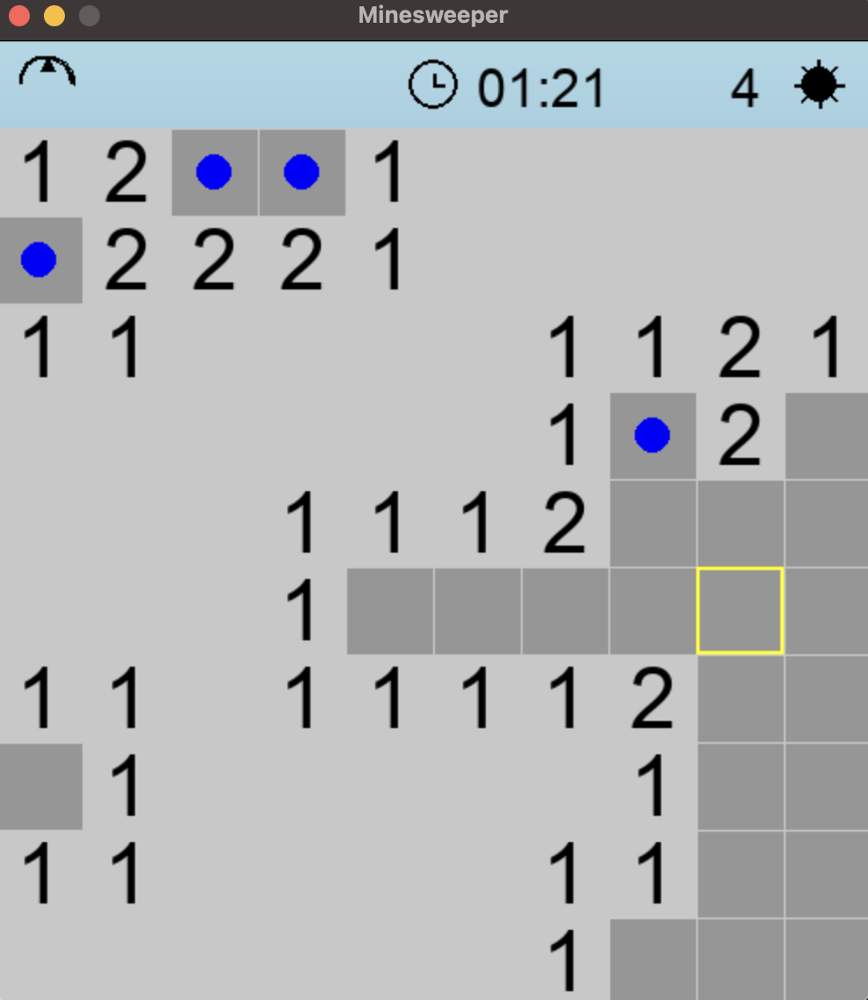

# Modern Minesweeper

A sleek, modern twist on the classic Minesweeper game, packed with updated visuals and sound effects for a fresh puzzle experience.

## Features
- **Gradient Background**: Smooth, stylish backdrop.
- **Beveled Grid**: 3D-effect cells for a polished look.
- **Animations**: Win with flagged mines or see mines flash red on loss.
- **Sound Effects**: Audio for clicks, flags, and game outcomes.
- **Timer**: Track your solving time.

## Installation
1. Install [Python](https://www.python.org/downloads/) and [Pygame](https://www.pygame.org/wiki/GettingStarted).
2. Clone this repo or download the files.
3. Run `python main.py` to play.

## How to Play
- **Left-click**: Reveal a cell.
- **Right-click**: Flag a mine.
- Win by clearing all non-mine cells.

## Screenshot
  

## Credits
- Sound effects from [Freesound](https://freesound.org/).
- Inspired by classic Minesweeper.